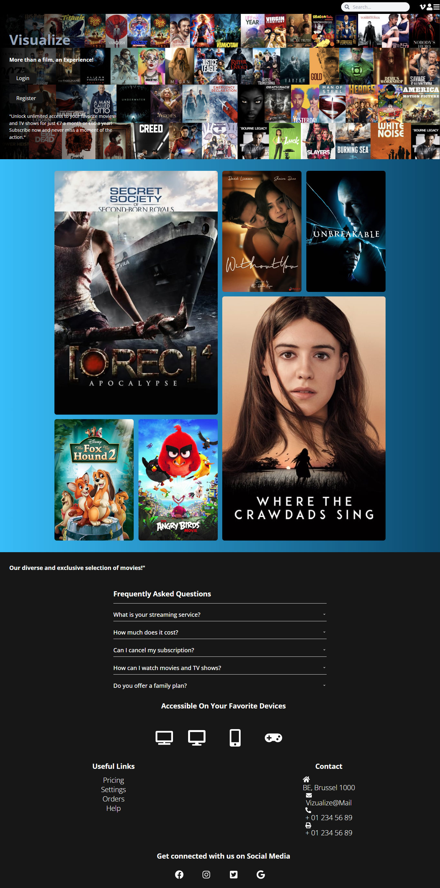

# Visualize

### Team

- [Alex](https://github.com/atsoakalex)

- [Billal](https://github.com/Bilallamrani)

- [Yves](https://github.com/yvsmlk)

- [Etienne](https://github.com/liolle)

### Description

Visualize is a streaming website that allows users to choose from a huge movie catalogue. Users can create an account, search for content, and leave comments on videos. 

### Technologies Used
- React (TypeScript) for the front-end
- Tailwind for styling
- Node.js (TypeScript) and Express for the back-end
- MySQL for the database
### ERD

### Demo

### Sources 
Here are some of the sources we used to help us build this project:

- [React](https://fr.reactjs.org/)
- [Tailwind](https://tailwindcss.com/)
- [Node.js](https://nodejs.org/en/docs/)
- [Express](https://expressjs.com/)
- [MySQL](https://www.mysql.com/fr/)
